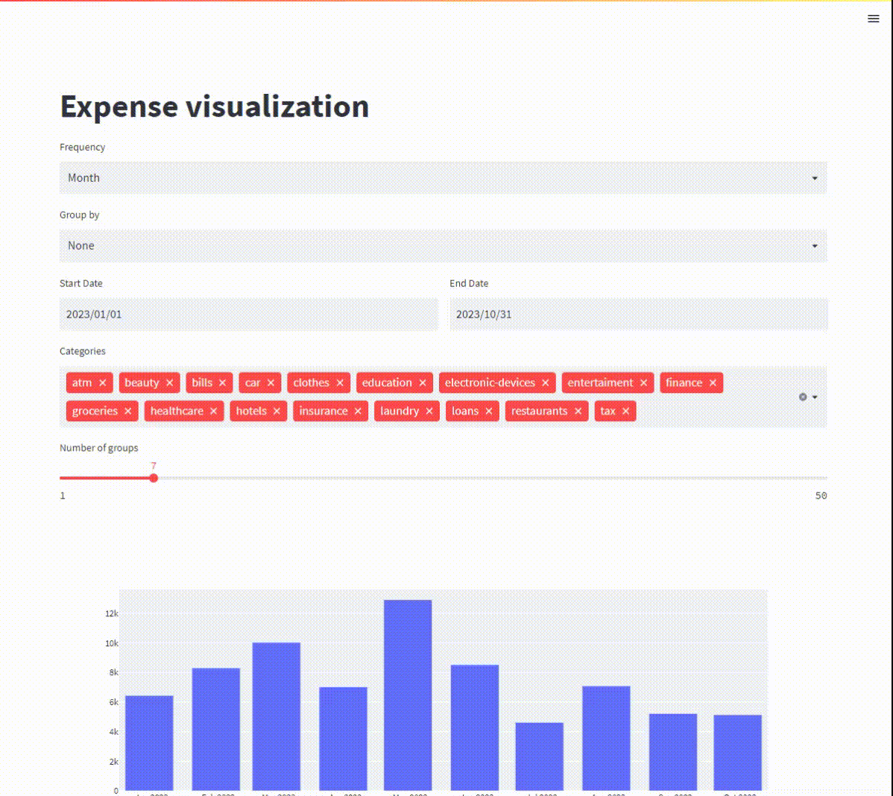

# money-insights
Fully offline modern looking analysis of personal finance

# Installation
* Make sure you have `poetry` installed 
* Run `poetry install` in project's directory. This will create a virtual environment by defaul in `./.venv` directory
* `poetry shell` to activate the environment
* `streamlit run ./project/app.py` to start the app

# Usage
* put your transactions data in `./data/transactions`
  * ING (Polish) 
    * go to `https://login.ingbank.pl/`
    * go to transactions history
    * get the list of transactions as CSV
    * place the file in `./data/transactions/ing/`
  * mBank (Polish) 
    * (...)
    * place the file in `./data/transactions/mbank/`
  * generic format (to do)
* work on your categories (`./data/categories/categories_conditions.csv`)

